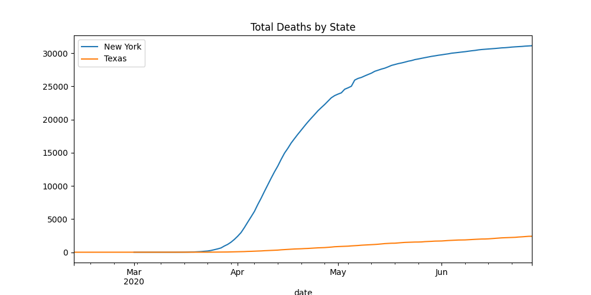
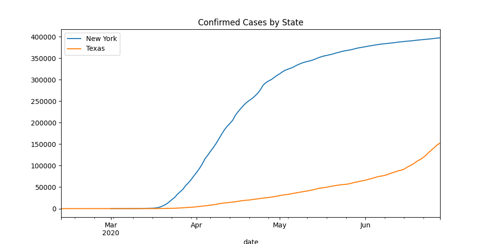
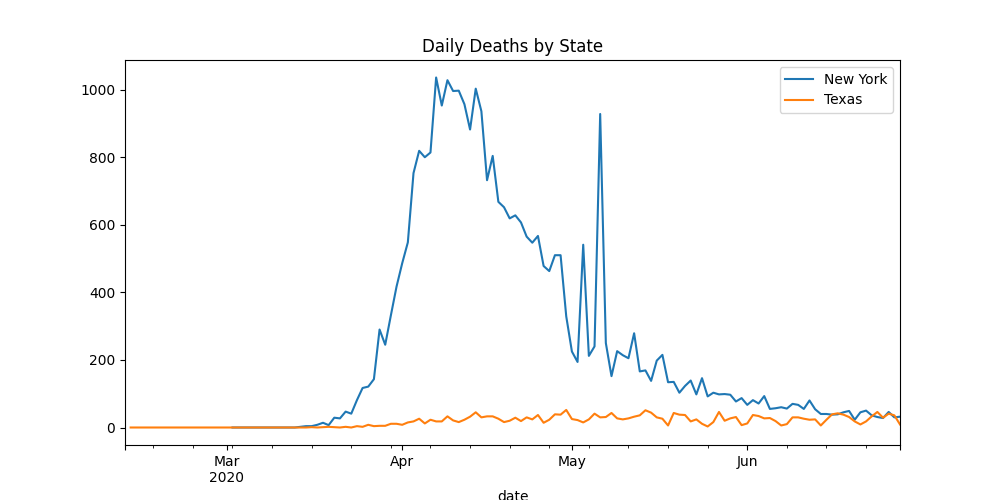

# Covid19 Metrics
This is a silly little project I wrote to graph various metrics related to Covid19. 

It uses [Google Public Datasets for Covid19]([https://cloud.google.com/blog/products/data-analytics/free-public-datasets-for-covid19)
for it's data sources and [Pandas] (https://pandas.pydata.org/) for graphing of data. 

## Examples
`./covid_metrics Texas "New York"`
()

`./covid_metrics Texas "New York" -m confirmed_cases`
()

`./covid_metrics Texas "New York" -m new_deaths`
()

## Prereqs 
You can't use my google cloud account, because, well, it's mine and people sometimes do stupid stuff. So, you'll
need to quickly create a new Google Cloud Project (it's free) and set up authentication. It takes about 30 seconds.
Instructions are [here](https://cloud.google.com/docs/authentication/getting-started). 

## Install
*You'll need Docker and GNU Make (and git, of course).*
 
1. Clone this repo
1. cd into the repo
1. Save the credentials file you created in the prereqs section as `google_creds.json` in the root folder of this repo.
1. run `make`
1. Once you've done this, you can simple execute `./covid_metrics <state1> <state2> <state3> -m new_deaths`.